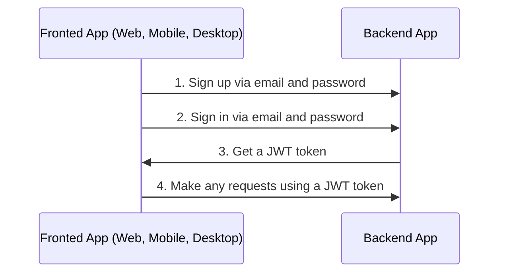
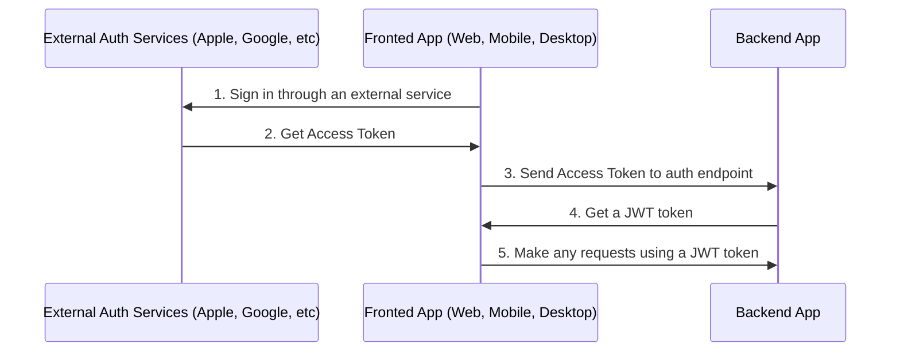

# Autenticação

## Índice <!-- omit in toc -->

- [Informações gerais](#informacoes-gerais)
  - [Fluxo de autenticação via e-mail](#fluxo-de-autenticacao-via-e-mail)
  - [Fluxo de autenticação via serviços externos ou redes sociais](#fluxo-de-autenticacao-via-servicos-externos-ou-redes-sociais)
- [Configurar autenticação](#configurar-autenticacao)
- [Autenticação via Apple](#autenticacao-via-apple)
- [Autenticação via Facebook](#autenticacao-via-facebook)
- [Autenticação via Google](#autenticacao-via-google)
- [Sobre a estratégia JWT](#sobre-a-estrategia-jwt)
- [Fluxo do refresh token](#fluxo-do-refresh-token)
  - [Exemplo em vídeo](#exemplo-em-video)
  - [Suporte a login em múltiplos dispositivos / Sessões](#suporte-a-login-em-multiplos-dispositivos--sessoes)
- [Logout](#logout)
- [Perguntas e Respostas](#perguntas-e-respostas)
  - [Após `POST /api/v1/auth/logout` ou remover a sessão do banco, o usuário ainda pode fazer requisições com o `access token` por um tempo. Por quê?](#apos-post-apiv1authlogout-ou-remover-a-sessao-do-banco-o-usuario-ainda-pode-fazer-requisicoes-com-o-access-token-por-um-tempo-por-que)

---

## Informações gerais

### Fluxo de autenticação via e-mail

Por padrão, o boilerplate usa login e cadastro via e-mail e senha.



<https://user-images.githubusercontent.com/6001723/224566194-1c1f4e98-5691-4703-b30e-92f99ec5d929.mp4>

### Fluxo de autenticação via serviços externos ou redes sociais

Você também pode se cadastrar via outros serviços externos ou redes sociais como Apple, Facebook e Google.



Para autenticação com serviços externos ou redes sociais você precisa:

1. Fazer login pelo serviço externo e obter o access token.
1. Chamar um dos endpoints com o access token recebido no frontend e obter o JWT do backend.

   ```text
   POST /api/v1/auth/facebook/login

   POST /api/v1/auth/google/login

   POST /api/v1/auth/apple/login
   ```

1. Fazer requisições usando o JWT

---

## Configurar autenticação

1. Gere as chaves secretas para `access token` e `refresh token`:

   ```bash
   node -e "console.log('\nAUTH_JWT_SECRET=' + require('crypto').randomBytes(256).toString('base64') + '\n\nAUTH_REFRESH_SECRET=' + require('crypto').randomBytes(256).toString('base64') + '\n\nAUTH_FORGOT_SECRET=' + require('crypto').randomBytes(256).toString('base64') + '\n\nAUTH_CONFIRM_EMAIL_SECRET=' + require('crypto').randomBytes(256).toString('base64'));"
   ```

1. Vá para `/.env` e substitua `AUTH_JWT_SECRET` e `AUTH_REFRESH_SECRET` pelo resultado do passo 1.

   ```text
   AUTH_JWT_SECRET=CHAVE_SECRETA_DO_PASSO_1
   AUTH_REFRESH_SECRET=CHAVE_SECRETA_DO_PASSO_1
   ```

## Autenticação via Apple

1. [Configure seu serviço na Apple](https://www.npmjs.com/package/apple-signin-auth)
1. Altere `APPLE_APP_AUDIENCE` no `.env`

   ```text
   APPLE_APP_AUDIENCE=["com.empresa", "com.empresa.web"]
   ```

## Autenticação via Facebook

1. Acesse https://developers.facebook.com/apps/creation/ e crie um novo app
   

   
2. Vá em `Settings` -> `Basic` e pegue o `App ID` e `App Secret`
   
3. Altere `FACEBOOK_APP_ID` e `FACEBOOK_APP_SECRET` no `.env`

   ```text
   FACEBOOK_APP_ID=123
   FACEBOOK_APP_SECRET=abc
   ```

## Autenticação via Google

1. Você precisa de `CLIENT_ID`, `CLIENT_SECRET`. Encontre essas informações no [Developer Console](https://console.cloud.google.com/), clique no seu projeto (ou crie um em https://console.cloud.google.com/projectcreate) -> `APIs & services` -> `credentials`.
1. Altere `GOOGLE_CLIENT_ID` e `GOOGLE_CLIENT_SECRET` no `.env`

   ```text
   GOOGLE_CLIENT_ID=abc
   GOOGLE_CLIENT_SECRET=abc
   ```

## Sobre a estratégia JWT

No método `validate` do arquivo `src/auth/strategies/jwt.strategy.ts`, não verificamos se o usuário existe no banco porque é redundante, pode perder os benefícios do JWT e afetar a performance.

Para entender melhor como JWT funciona, veja o vídeo https://www.youtube.com/watch?v=Y2H3DXDeS3Q e leia https://jwt.io/introduction/

```typescript
// src/auth/strategies/jwt.strategy.ts

@Injectable()
export class JwtStrategy extends PassportStrategy(Strategy, 'jwt') {
  // ...

  public validate(payload) {
    if (!payload.id) {
      throw new UnauthorizedException();
    }

    return payload;
  }
}
```

> Se precisar de informações completas do usuário, obtenha nos serviços.

## Fluxo do refresh token

1. No login (`POST /api/v1/auth/email/login`) você receberá `token`, `tokenExpires` e `refreshToken` na resposta.
1. Em cada requisição, envie o `token` no header `Authorization`.
1. Se o `token` expirar (verifique com `tokenExpires` no app cliente), envie o `refreshToken` para `POST /api/v1/auth/refresh` no header `Authorization` para renovar o `token`. Você receberá novos `token`, `tokenExpires` e `refreshToken`.

### Exemplo em vídeo

https://github.com/brocoders/nestjs-boilerplate/assets/6001723/f6fdcc89-5ec6-472b-a6fc-d24178ad1bbb

### Suporte a login em múltiplos dispositivos / Sessões

O boilerplate suporta login em múltiplos dispositivos com fluxo de Refresh Token. Isso é possível devido às `sessions`. Ao fazer login, uma nova sessão é criada e salva no banco. O registro da sessão contém `sessionId (id)`, `userId` e `hash`.

Em cada `POST /api/v1/auth/refresh` verificamos o `hash` do banco com o do Refresh Token. Se forem iguais, retornamos novos `token`, `tokenExpires` e `refreshToken`. Depois atualizamos o `hash` no banco para impedir o uso do Refresh Token anterior.

## Logout

1. Chame o endpoint:

   ```text
   POST /api/v1/auth/logout
   ```

2. Remova o `access token` e `refresh token` do app cliente (cookies, localStorage, etc).

## Perguntas e Respostas

### Após `POST /api/v1/auth/logout` ou remover a sessão do banco, o usuário ainda pode fazer requisições com o `access token` por um tempo. Por quê?

Porque usamos `JWT`. `JWTs` são stateless, então não podemos revogá-los, mas não se preocupe, esse é o comportamento correto e o access token irá expirar após o tempo definido em `AUTH_JWT_TOKEN_EXPIRES_IN` (padrão 15 minutos). Se precisar revogar tokens JWT imediatamente, verifique se a sessão existe em [jwt.strategy.ts](https://github.com/brocoders/nestjs-boilerplate/blob/2896589f52d2df025f12069ba82ba4fac1db8ebd/src/auth/strategies/jwt.strategy.ts#L20-L26) em cada requisição. Porém, não é recomendado pois pode afetar a performance.

---

Anterior: [Banco de Dados](database.md)

Próximo: [Serialização](serialization.md)
