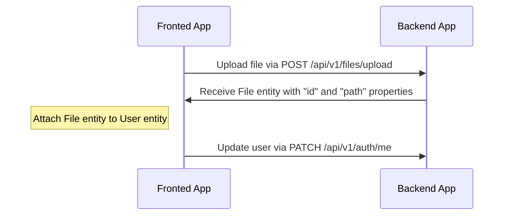
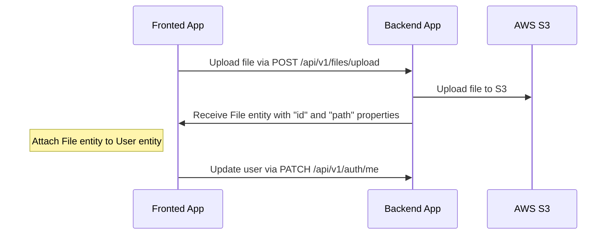
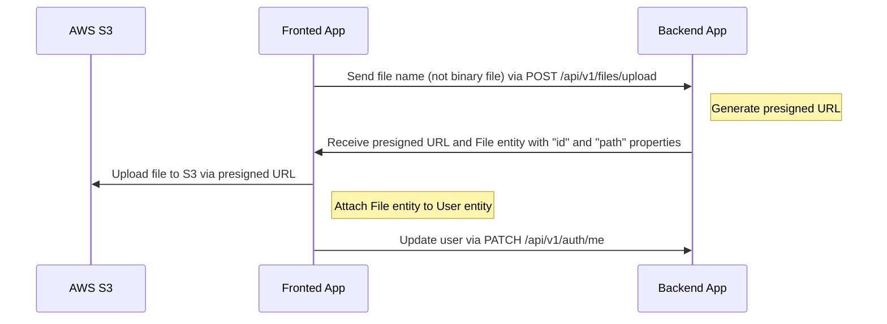

# Upload de Arquivos

---

## Índice <!-- omit in toc -->

- [Drivers suportados](#drivers-suportados)
- [Fluxo de upload e anexar arquivo para driver `local`](#fluxo-de-upload-e-anexar-arquivo-para-driver-local)
  - [Exemplo de upload de avatar para perfil de usuário (local)](#exemplo-de-upload-de-avatar-para-perfil-de-usuario-local)
  - [Exemplo em vídeo](#exemplo-em-video)
- [Fluxo de upload e anexar arquivo para driver `s3`](#fluxo-de-upload-e-anexar-arquivo-para-driver-s3)
  - [Configuração para driver `s3`](#configuracao-para-driver-s3)
  - [Exemplo de upload de avatar para perfil de usuário (S3)](#exemplo-de-upload-de-avatar-para-perfil-de-usuario-s3)
- [Fluxo de upload e anexar arquivo para driver `s3-presigned`](#fluxo-de-upload-e-anexar-arquivo-para-driver-s3-presigned)
  - [Configuração para driver `s3-presigned`](#configuracao-para-driver-s3-presigned)
  - [Exemplo de upload de avatar para perfil de usuário (S3 Presigned URL)](#exemplo-de-upload-de-avatar-para-perfil-de-usuario-s3-presigned-url)
- [Como deletar arquivos?](#como-deletar-arquivos)

---

## Drivers suportados

O boilerplate suporta os seguintes drivers: `local`, `s3` e `s3-presigned`. Você pode definir no arquivo `.env`, variável `FILE_DRIVER`. Se quiser usar outro serviço para armazenar arquivos, pode estender.

> Para produção, recomendamos usar o driver "s3-presigned" para aliviar o servidor.

---

## Fluxo de upload e anexar arquivo para driver `local`

O endpoint `/api/v1/files/upload` é usado para upload de arquivos, retornando a entidade `File` com `id` e `path`. Após receber a entidade `File`, você pode anexá-la a outra entidade.

### Exemplo de upload de avatar para perfil de usuário (local)



### Exemplo em vídeo

<https://user-images.githubusercontent.com/6001723/224558636-d22480e4-f70a-4789-b6fc-6ea343685dc7.mp4>

## Fluxo de upload e anexar arquivo para driver `s3`

O endpoint `/api/v1/files/upload` é usado para upload de arquivos, retornando a entidade `File` com `id` e `path`. Após receber a entidade `File`, você pode anexá-la a outra entidade.

### Configuração para driver `s3`

1. Abra https://s3.console.aws.amazon.com/s3/buckets
1. Clique em "Create bucket"
1. Crie o bucket (por exemplo, `seu-bucket-unico`)
1. Abra seu bucket
1. Clique na aba "Permissions"
1. Encontre a seção "Cross-origin resource sharing (CORS)"
1. Clique em "Edit"
1. Cole a configuração abaixo

    ```json
    [
      {
        "AllowedHeaders": ["*"],
        "AllowedMethods": ["GET"],
        "AllowedOrigins": ["*"],
        "ExposeHeaders": []
      }
    ]
    ```

1. Clique em "Save changes"
1. Atualize o arquivo `.env` com as variáveis:

    ```dotenv
    FILE_DRIVER=s3
    ACCESS_KEY_ID=YOUR_ACCESS_KEY_ID
    SECRET_ACCESS_KEY=YOUR_SECRET_ACCESS_KEY
    AWS_S3_REGION=YOUR_AWS_S3_REGION
    AWS_DEFAULT_S3_BUCKET=YOUR_AWS_DEFAULT_S3_BUCKET
    ```

### Exemplo de upload de avatar para perfil de usuário (S3)



## Fluxo de upload e anexar arquivo para driver `s3-presigned`

O endpoint `/api/v1/files/upload` é usado para upload de arquivos. Neste caso, `/api/v1/files/upload` recebe apenas a propriedade `fileName` (sem arquivo binário), e retorna a `presigned URL` e a entidade `File` com `id` e `path`. Após receber a `presigned URL` e a entidade `File`, você precisa fazer upload do arquivo para a `presigned URL` e depois anexar o `File` a outra entidade.

### Configuração para driver `s3-presigned`

1. Abra https://s3.console.aws.amazon.com/s3/buckets
1. Clique em "Create bucket"
1. Crie o bucket (por exemplo, `seu-bucket-unico`)
1. Abra seu bucket
1. Clique na aba "Permissions"
1. Encontre a seção "Cross-origin resource sharing (CORS)"
1. Clique em "Edit"
1. Cole a configuração abaixo

    ```json
    [
      {
        "AllowedHeaders": ["*"],
        "AllowedMethods": ["GET", "PUT"],
        "AllowedOrigins": ["*"],
        "ExposeHeaders": []
      }
    ]
    ```

   Para produção, recomendamos uma configuração mais restrita:

   ```json
   [
     {
       "AllowedHeaders": ["*"],
       "AllowedMethods": ["PUT"],
       "AllowedOrigins": ["https://your-domain.com"],
       "ExposeHeaders": []
     },
      {
        "AllowedHeaders": ["*"],
        "AllowedMethods": ["GET"],
        "AllowedOrigins": ["*"],
        "ExposeHeaders": []
      }
   ]
   ```

1. Clique em "Save changes"
1. Atualize o arquivo `.env` com as variáveis:

    ```dotenv
    FILE_DRIVER=s3-presigned
    ACCESS_KEY_ID=YOUR_ACCESS_KEY_ID
    SECRET_ACCESS_KEY=YOUR_SECRET_ACCESS_KEY
    AWS_S3_REGION=YOUR_AWS_S3_REGION
    AWS_DEFAULT_S3_BUCKET=YOUR_AWS_DEFAULT_S3_BUCKET
    ```

### Exemplo de upload de avatar para perfil de usuário (S3 Presigned URL)



## Como deletar arquivos?

Preferimos não deletar arquivos, pois isso pode causar problemas ao restaurar dados. Por isso, também usamos [Soft-Delete](https://orkhan.gitbook.io/typeorm/docs/delete-query-builder#soft-delete) no banco. Porém, se precisar deletar arquivos, crie seu próprio handler, cronjob, etc.

---

Anterior: [Serialização](serialization.md)

Próximo: [Testes](tests.md)
